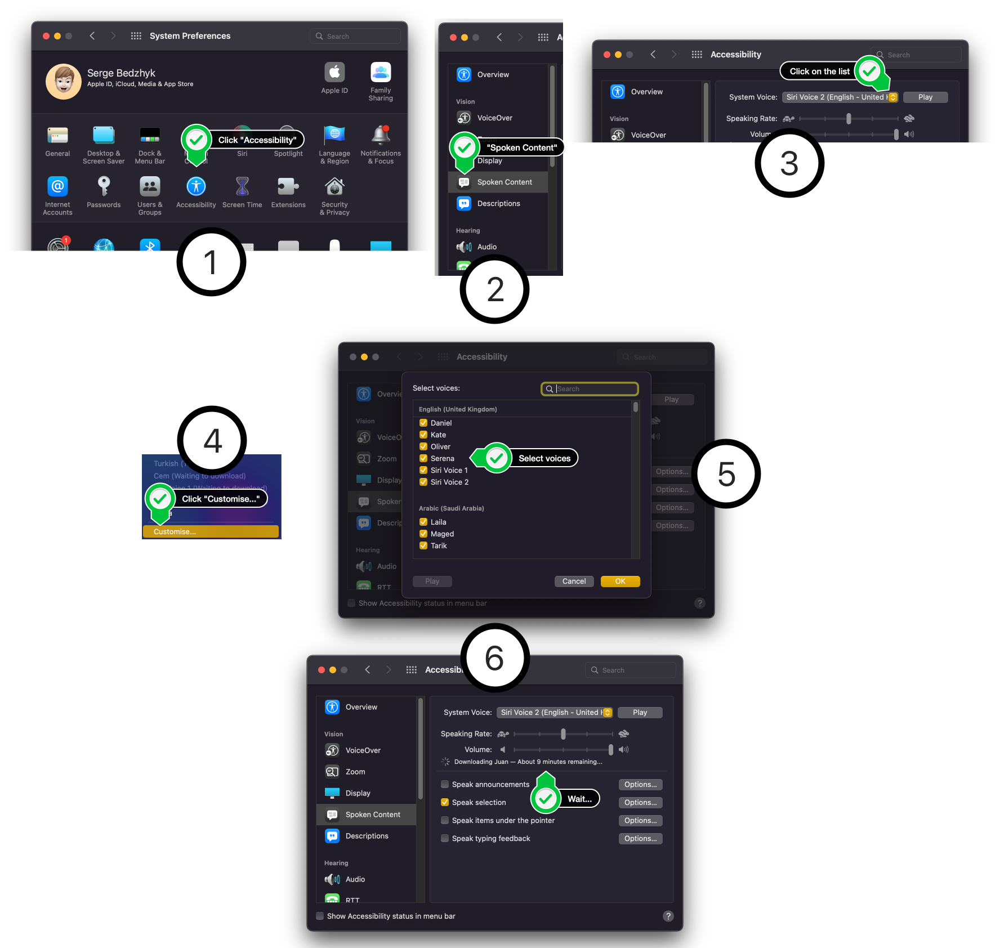

# mac-say

<p align="center">
  
</p>

> Ruby wrapper around the modern version of the macOS `say` command. Inspired by the @bratta's [mactts](https://github.com/bratta/mactts)
>
> [](https://travis-ci.org/smileart/mac-say) [](https://coveralls.io/github/smileart/mac-say?branch=dev) [](https://inch-ci.org/github/smileart/mac-say)

* [Homepage](https://rubygems.org/gems/mac-say)
* [Documentation](http://rubydoc.info/gems/mac-say/frames)
* [Email](mailto:smileart21 at gmail.com)

## Features

* [x] Basic strings reading
* [x] Basic files reading
* [x] Multiline strings support
* [x] Dynamic voices parsing (based on real `say` output)
* [x] Voices list generation (including samples and ISO information)
* [x] Voices search (by name / language / country)
* [x] Simple (class-level) and customisable (instance-level) usage
* [ ] Observe reading progress line by line❓
* [ ] Audio output support❓

## Install

```sh
$ gem install mac-say
```

## Examples

```ruby
require 'pp'
require 'mac/say'

# ===== Class level =====

# Get all the voices
pp Mac::Say.voices

# Collect the separate features lists
pp Mac::Say.voices.collect {|v| v[:name]}
pp Mac::Say.voices.collect {|v| v[:iso_code]}
pp Mac::Say.voices.collect {|v| v[:sample]}

# Find a voice (returns a Hash)
pp Mac::Say.voice(:name, :alex)
pp Mac::Say.voice(:country, :scotland)

# Find the voices by the feature (returns an Array)
pp Mac::Say.voice(:language, :en)

# Work with the voices collection
indian_english = Mac::Say.voice(:country, :in).select {|v| v[:iso_code][:language] == :en}.first[:name]

# Use multiline text
puts Mac::Say.say <<-DATA, indian_english
  Invokes the given block passing in successive elements from self, deleting elements for which the block returns a false value.
  The array may not be changed instantly every time the block is called.
  If changes were made, it will return self, otherwise it returns nil.
DATA

# ===== Instance level =====

# with constant name in the constructor and custom rate
talker = Mac::Say.new(voice: :alex, rate: 300)
talker.say string: "Hello world"

# with the voice name from the class method + dynamic sample
talker = Mac::Say.new(voice: Mac::Say.voice(:country, :scotland)[:name])
talker.say string: talker.voice(:country, :scotland)[:sample]

# with the dynamic voice name selected from the multiple voices
talker = Mac::Say.new
voice = talker.voice(:language, :en)&.sample(1)&.first&.fetch :name
talker.say string: "Hello world!", voice: voice

# changing voice in runtime for an instance of talker (while saying something)
voice = talker.voice(:country, :kr)
talker.say string: voice[:sample], voice: voice[:name]

# or change the voice without saying anything
talker.say voice: :"ting-ting"
talker.say string: '您好，我叫Ting-Ting。我讲中文普通话。'

# Listen to all the languages with the dynamic voices + dynamic samples
polyglot = Mac::Say.new
voices = polyglot.voices

voices.each_with_index do |v, i|
  puts "#{i+1} :: #{v[:name]} :: '#{v[:sample]}'"
  polyglot.say string: v[:sample], voice: v[:name]
end

# Or perform a roll call
roll_call = Mac::Say.new
voices = roll_call.voices

voices.each_with_index do |v, i|
  puts "#{i+1} :: #{v[:name]}"
  roll_call.say string: v[:name], voice: v[:name]
end

# ===== Reading files =====

# Read the file (prior to the string)
file_path = File.absolute_path '../test/fixtures/text/en_gb.txt', File.dirname(__FILE__)

# with a voice from the class
voice = Mac::Say.voice(:country, :gb)&.first[:name]
reader = Mac::Say.new(file: file_path, voice: voice)
reader.read

# with a dynamic voice from the class
voice = Mac::Say.voice(:country, :scotland)[:name]
reader = Mac::Say.new(file: file_path)
reader.read voice: voice

# with a dynamic voice from the instance
reader = Mac::Say.new(file: file_path)
reader.read(voice: reader.voice(:country, :us)[2][:name])

# with a dynamic voice from the instance
new_file_path = File.absolute_path '../test/fixtures/text/en_us.txt', File.dirname(__FILE__)

# with a dynamic file change
reader = Mac::Say.new(file: file_path)
reader.read voice: :alex
reader.read file: new_file_path


# ===== Exceptions =====

# wrong file
begin
  reader = Mac::Say.new(file: 'wrong')
  reader.read
rescue Mac::Say::FileNotFound => e
  puts e.message
end

# wrong file
begin
  reader = Mac::Say.new
  reader.read file: 'too_wrong'
rescue Mac::Say::FileNotFound => e
  puts e.message
end

# wrong path
begin
  Mac::Say.new(say_path: '/usr/bin/wrong_say')
rescue Mac::Say::CommandNotFound => e
  puts e.message
end

# wrong voice
begin
  talker = Mac::Say.new(voice: :wrong)
  talker.say string: 'OMG! I lost my voice!'
rescue Mac::Say::VoiceNotFound => e
  puts e.message
end

# wrong voice
begin
  talker = Mac::Say.new
  talker.say string: 'OMG! I lost my voice!', voice: :too_wrong
rescue Mac::Say::VoiceNotFound => e
  puts e.message
end

# wrong voice
begin
  Mac::Say.say 'OMG! I lost my voice!', :still_wrong
rescue Mac::Say::VoiceNotFound => e
  puts e.message
end

# wrong feature
begin
  Mac::Say.voice(:tone, :enthusiastic)
rescue Mac::Say::UnknownVoiceFeature => e
  puts e.message
end

# wrong feature
begin
  Mac::Say.new.voice(:articulation, :nostalgic)
rescue Mac::Say::UnknownVoiceFeature => e
  puts e.message
end
```

## Installing & Updating MacOS TTS Voices

Open `System Preferences` using Spotlight / Alfred / Dock and follow text or visual instructions:

```
System Preferences → Accessibility → Speech → System Voice →
→ Customize… → (select voices) → OK → (Wait for download…)
```



## Dev Notes

```sh
# generated with Ore: https://github.com/ruby-ore/ore
$ mine mac-say --git --mit --rubygems-tasks --markdown --minitest --travis --yard

# generate docs (unless this resolved: https://github.com/rrrene/inch/issues/42)
$ yard --markup markdown --markup-provider=redcarpet --title "mac-say Documentation" --protected --asset img:img

# check the docs
$ inch --pedantic

# test with a fake `say`
$ USE_FAKE_SAY='./test/fake/say' bundle exec rake test

# test with rake
$ bundle exec rake test

# test with m
$ bundle exec m

# run one test by LN
$ bundle exec m ./test/test_mac-say.rb:34
```

## Copyright

Copyright (c) 2017 Serge Bedzhyk

See [LICENSE.txt](./LICENSE.txt) for details.
